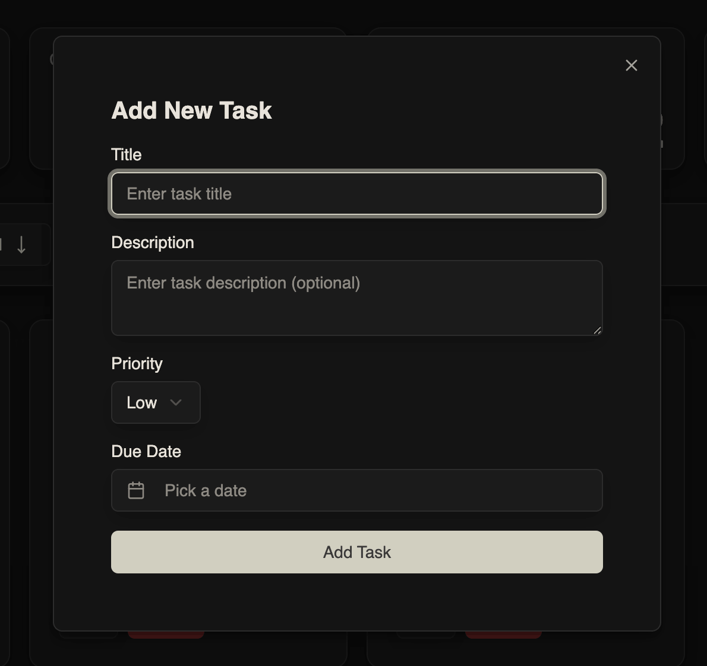
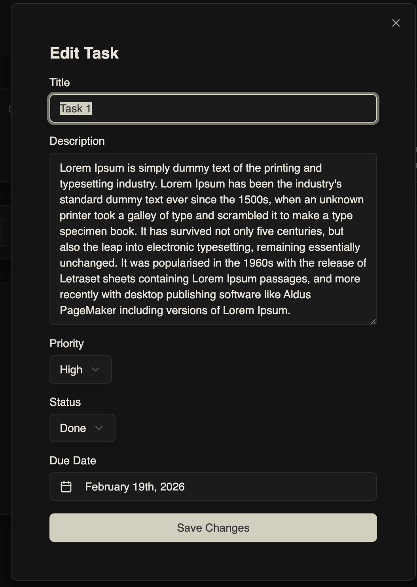
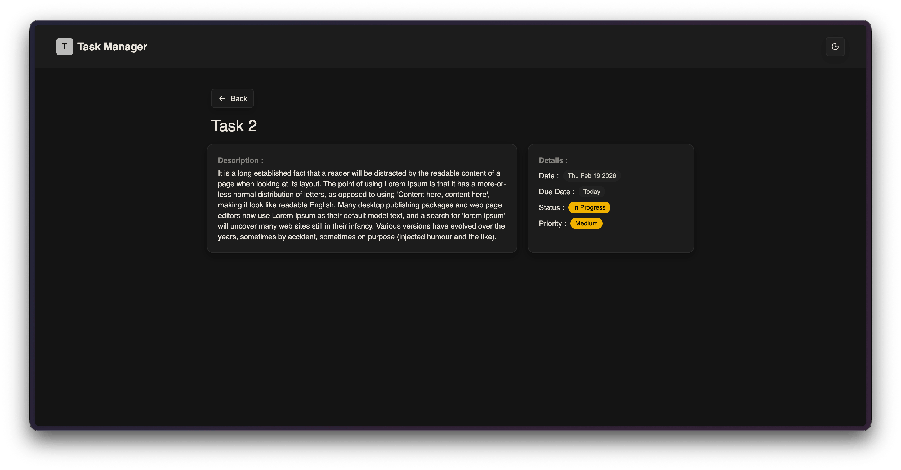
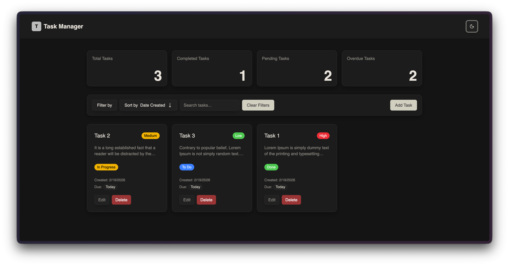
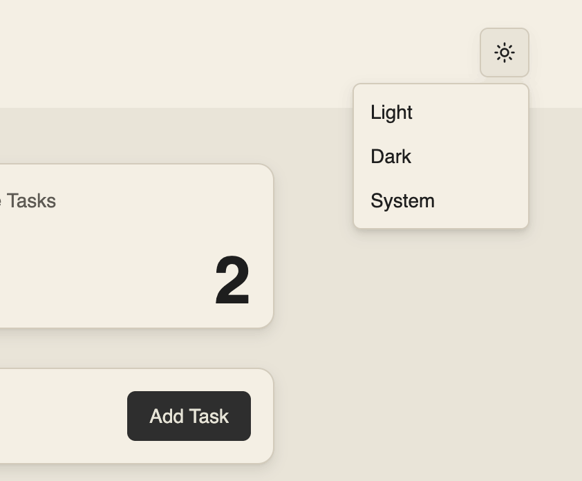

# Task Manager

THIS IS AI GENERATED README FILE
A modern, feature-rich task management application built with React, Vite, and Tailwind CSS.

## 🚀 Tech Stack

- **Framework:** [React](https://react.dev/) + [Vite](https://vitejs.dev/)
- **Styling:** [Tailwind CSS](https://tailwindcss.com/)
- **UI Components:** [Shadcn UI](https://ui.shadcn.com/)
- **Icons:** [Lucide React](https://lucide.dev/)
- **Animations:** [Motion](https://motion.dev/)
- **Routing:** [React Router](https://reactrouter.com/)
- **Date Handling:** [date-fns](https://date-fns.org/)
- **Notifications:** [Sonner](https://sonner.emilkowal.ski/)

## ✨ Features

### Add Task

Easily create new tasks to keep track of your work.


### Edit Task

Update task details and modify their status as your work progresses.


### Delete Task & Undo

Remove unwanted tasks. Accidentally deleted something? Undo the action immediately.


### Task Execution Status

Mark tasks as **Todo**, **In Progress**, or **Completed** to track development flow.

### Task Details Route

View comprehensive details for any specific task on its own dedicated page.


### Statistics

Visualize your productivity with built-in statistics.


### Dark & Light Mode

Switch between dark and light themes to suit your preference.


## 🛠️ Installation & Setup

Follow these steps to get the project running locally:

1. **Clone the repository**

   ```bash
   git clone <repository-url>
   cd task-manager
   ```

2. **Install dependencies**

   ```bash
   npm install
   ```

3. **Run the development server**
   ```bash
   npm run dev
   ```

The application will be available at `http://localhost:5173`.

## 📄 License

This project is open source and available under the [MIT License](LICENSE).
